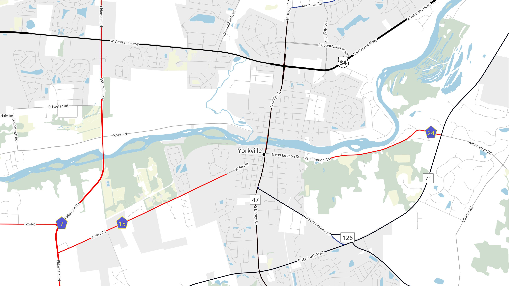

# Creating & Using a Live, Localized Extract of OpenStreetMap

----

# Overview

- Introduction
- OSM Data
- Import Scenarios
- Keeping it Up to Date
- Using it
- Questions

---

## Steal this presentation!


https://github.com/jdcarls2/ilgisa-2023

----

# OpenStreetMap Data

---

## What is OSM?

*"The Wikipedia of Maps"*

OSM is a **dataset**, which is...

- global
- open
- used to map nearly anything
- one of my favorite things

---

## Is anyone actually using it?

- Amazon Logistics <!-- .element: class="fragment" -->
- Tesla Smart Summon feature <!-- .element: class="fragment" -->
- Esri (basemaps, feature services) <!-- .element: class="fragment" -->
- Pokemon Go <!-- .element: class="fragment" -->
- Red Cross <!-- .element: class="fragment" -->
- Kendall County! <!-- .element: class="fragment" -->
- Many, many others <!-- .element: class="fragment" -->

Note: The point here is that there's clearly *something* of value in this dataset, if you can just get at it.

---

## OpenStreetMap Data: *It's weird!*

The OSM dataset has:

- **no layers** <!-- .element: class="fragment" -->
- **no schema** <!-- .element: class="fragment" -->
- **no polygons** <!-- .element: class="fragment" -->

 <!-- .element: class="fragment" -->

---

To be more precise, OSM is an **object-oriented data model**.

Every element in the dataset can have an arbitrary number of key-value pairs. In OSM, we call those "tags".

```js[4-8|11-17]
{
  "elements": [
    {
      "type": "node",
      "id": 1,
      "tags": {
        "amenity": "bench"
      }
    },
    {
      "type": "way",
      "id" 2,
      "tags": {
        "natural": "water",
        "water": "lake",
        "name": "Lake Plano"
      }
    }
  ]
}
```
---


---



---